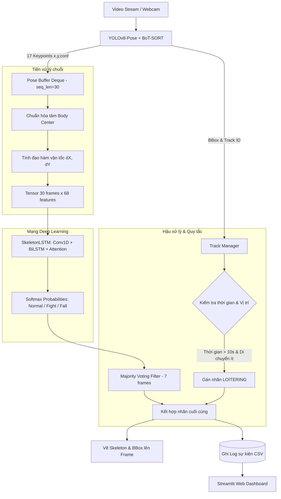

# 🎥 Real-time Abnormal Behavior Detection System

<p align="center">
  
  
  
  
  
  
</p>

Hệ thống Camera giám sát thông minh nhận diện hành vi bất thường theo thời gian thực (Real-time). Dự án ứng dụng kiến trúc **Hybrid (Lai)** kết hợp **YOLOv8-Pose**, mạng nơ-ron sâu nhẹ **1D-CNN + BiLSTM + Attention** và thuật toán **Rule-based Spatio-Temporal** nhằm đạt tốc độ FPS cao, độ trễ thấp và bảo vệ quyền riêng tư người dùng.

---

## 📋 Mục lục
- [1. Tính năng nổi bật](#1-tính-năng-nổi-bật)
- [2. Danh mục hành vi nhận diện](#2-danh-mục-hành-vi-nhận-diện)
- [3. Kiến trúc hệ thống (Pipeline)](#3-kiến-trúc-hệ-thống-pipeline)
- [4. Chi tiết mô hình AI (SkeletonLSTM)](#4-chi-tiết-mô-hình-ai-skeletonlstm)
- [5. Cấu trúc thư mục dự án](#5-cấu-trúc-thư-mục-dự-án)
- [6. Cài đặt môi trường](#6-cài-đặt-môi-trường)
- [7. Chuẩn bị trọng số (Weights)](#7-chuẩn-bị-trọng-số-weights)
- [8. Hướng dẫn khởi chạy](#8-hướng-dẫn-khởi-chạy)
- [9. Huấn luyện lại mô hình (Training)](#9-huấn-luyện-lại-mô-hình-training)
- [10. Cấu hình hệ thống (Settings)](#10-cấu-hình-hệ-thống-settings)
- [11. Kế hoạch phát triển (Roadmap)](#11-kế-hoạch-phát-triển-roadmap)
- [12. Giấy phép (License)](#12-giấy-phép-license)

---

## 1. Tính năng nổi bật

- ⚡ **Nhận diện Real-time (FPS cao):** Tối ưu hóa pipeline xử lý, chạy mượt mà trên GPU (CUDA) và hỗ trợ CPU.
- 👥 **Multi-person Tracking:** Định danh đồng thời nhiều người trong khung hình thông qua thuật toán tracking BoT-SORT.
- 🔒 **Bảo vệ quyền riêng tư (Privacy-preserving):** Chỉ trích xuất và huấn luyện trên 17 điểm tọa độ khớp xương (Skeleton Keypoints), không lưu trữ và không phân tích khuôn mặt/đặc trưng ngoại hình.
- 🎯 **Cơ chế Hybrid thông minh:**
  - Hành vi động phức tạp (đánh nhau, té ngã) được suy luận qua mạng Deep Learning (BiLSTM).
  - Hành vi tĩnh/không gian (đứng chờ, lảng vảng) được xử lý bằng giải thuật Rule-based tính toán thời gian và dịch chuyển bounding box, tránh quá tải cho model AI.
- 📊 **Trực quan hóa Dashboard:** Giao diện Web Streamlit hiện đại, cung cấp biểu đồ phân tích tần suất vi phạm, nhật ký sự kiện và xem lại video vi phạm.
- 🛡️ **Lọc nhiễu dự đoán (Temporal Smoothing):** Áp dụng Majority Voting trên chuỗi các frame gần nhất, giảm tối đa hiện tượng nhấp nháy nhãn (flickering).

---

## 2. Danh mục hành vi nhận diện

| Hành vi | Nhãn (`class`) | Phương pháp nhận diện | Màu cảnh báo | Ý nghĩa giám sát |
| :--- | :---: | :---: | :---: | :--- |
| **Bình thường** | `normal` | AI (1D-CNN + BiLSTM) | 🟢 Xanh lá | Hoạt động sinh hoạt, đi lại bình thường |
| **Đánh nhau / Ẩu đả** | `fighting` | AI (1D-CNN + BiLSTM) | 🔴 Đỏ | Hành vi bạo lực, tác động vật lý mạnh giữa người với người |
| **Té ngã / Đột quỵ** | `falling` | AI (1D-CNN + BiLSTM) | 🟠 Cam | Người ngã xuống sàn, tai nạn lao động hoặc sự cố y tế |
| **Lảng vảng / Đứng lâu**| `loitering`| Rule-based Spatio-Temporal | 🔵 Xanh dương | Người đứng yên trong một khu vực vượt quá ngưỡng thời gian quy định |

---

## 3. Kiến trúc hệ thống (Pipeline)

Quy trình xử lý dữ liệu từ luồng video đầu vào đến kết quả cảnh báo:



---

## 4. Chi tiết mô hình AI (SkeletonLSTM)

Mô hình [core/models/lstm_skeleton.py](file:///f:/Project/Abnormal_Behavior_Detection_System/core/models/lstm_skeleton.py) được thiết kế chuyên biệt cho dữ liệu chuỗi khung xương nhẹ:

1. **Input Representation:**
   - Mỗi frame gồm 17 keypoints $(x, y)$ và vận tốc $(\Delta x, \Delta y) \rightarrow 17 \times 4 = 68$ đặc trưng.
   - Cửa sổ thời gian (Sliding Window): $30$ frames (tương đương 1 giây ở 30 FPS).
   - Kích thước tensor đầu vào: `(batch_size, 30, 68)`.

2. **Cấu trúc mạng:**
   - **Layer Normalization:** Chuẩn hóa phân phối đặc trưng đầu vào.
   - **1D Convolutional Layer:** `Conv1d(in=68, out=64, kernel=3, padding=1)` nhằm nắm bắt mối tương quan không gian cục bộ giữa các khớp.
   - **Bidirectional LSTM (2 Layers):** `hidden_size=128`, trích xuất thông tin chuỗi hai chiều (quá khứ và tương lai).
   - **Attention Mechanism:** Tính trọng số chú ý cho từng frame trong cửa sổ 30 frame, tập trung vào các khoảnh khắc đột biến (như cú đấm, khoảnh khắc tiếp đất khi ngã).
   - **Classification Head:** Linear Layers kết hợp Dropout (0.5) đưa ra xác suất 3 lớp: `normal`, `fighting`, `falling`.

---

## 5. Cấu trúc thư mục dự án

```text
Abnormal_Behavior_Detection_System/
├── config/
│   ├── settings.py                  # Cấu hình toàn cục (paths, model params, training)
│   ├── model_config.yaml            # YAML cấu hình mô hình
│   └── training_config.yaml         # YAML cấu hình tham số huấn luyện
├── core/
│   ├── detection/
│   │   └── pose_tracker.py          # Bộ bóc tách Pose với YOLOv8 + BoT-SORT
│   ├── models/
│   │   └── lstm_skeleton.py         # Kiến trúc mạng SkeletonLSTM
│   ├── inference/
│   │   ├── preprocessor.py          # Chuẩn hóa tọa độ & trích xuất vận tốc
│   │   ├── postprocessor.py         # Majority voting & Rule-based Loitering
│   │   └── pipeline.py              # Pipeline suy luận Real-time hoàn chỉnh
│   └── training/
│       ├── dataset.py               # DataLoader & Kỹ thuật Augmentation
│       └── evaluation.py            # Đánh giá mô hình (F1, Confusion Matrix)
├── web/
│   ├── app.py                       # Streamlit Web Dashboard chính
│   └── pages/
│       └── analysis.py              # Trang phân tích thống kê chuyên sâu
├── scripts/
│   ├── data_processing/
│   │   └── build_sequences.py       # Trích xuất video raw thành dữ liệu .npy
│   ├── training/
│   │   └── train_model.py           # Huấn luyện mạng SkeletonLSTM
│   └── deployment/                  # Batch scripts khởi chạy nhanh (.bat/.sh)
├── weights/
│   ├── detection/                   # Chứa yolov8s-pose.pt
│   └── classification/              # Chứa lstm_best.pth và checkpoints
├── data/
│   ├── raw/                         # Video huấn luyện gốc (fighting, falling, normal)
│   ├── processed/                   # Chuỗi sequence sau trích xuất
│   └── logs/                        # File CSV lưu nhật ký sự kiện
├── docker/                          # Cấu hình Docker & Docker Compose
├── docs/                            # Tài liệu bổ sung
├── requirements.txt                 # Danh sách thư viện phụ thuộc
├── run_webcam_demo.py               # Kịch bản chạy nhận diện qua Webcam
└── run_web.py                       # Kịch bản khởi động Dashboard
```

---

## 6. Cài đặt môi trường

### Yêu cầu tiên quyết:
- **Python**: Phiên bản `3.9` đến `3.11`.
- **Hệ điều hành**: Windows 10/11, Ubuntu 20.04+, hoặc macOS.
- **Card đồ họa (Khuyến khích)**: NVIDIA GPU có cài CUDA 11.8 hoặc 12.x để đạt FPS tối đa.

### Các bước cài đặt:

1. **Clone repository:**
   ```bash
   git clone https://github.com/NBasLongz/realtime-abnormal-behavior-detection.git
   cd realtime-abnormal-behavior-detection
   ```

2. **Tạo và kích hoạt môi trường ảo (Virtual Environment):**
   - Trên **Windows**:
     ```powershell
     python -m venv venv
     venv\Scripts\activate
     ```
   - Trên **Linux / macOS**:
     ```bash
     python3 -m venv venv
     source venv/bin/activate
     ```

3. **Cài đặt thư viện phụ thuộc:**
   ```bash
   pip install --upgrade pip
   pip install -r requirements.txt
   ```

   *(Tùy chọn: Nếu sử dụng GPU, hãy cài bản PyTorch tương thích CUDA từ [pytorch.org](https://pytorch.org/get-started/locally/)).*

---

## 7. Chuẩn bị trọng số (Weights)

Trước khi chạy hệ thống, cần đặt các file trọng số vào thư mục `weights/`:

1. **YOLOv8-Pose Model:**
   - Tải file trọng số `yolov8s-pose.pt` từ Ultralytics hoặc để code tự động tải khi chạy lần đầu.
   - Vị trí đặt: `weights/detection/yolov8s-pose.pt`

2. **SkeletonLSTM Model:**
   - Trọng số mô hình hành vi sau khi huấn luyện.
   - Vị trí đặt: `weights/classification/lstm_best.pth`

---

## 8. Hướng dẫn khởi chạy

### Cách 1: Chạy demo nhận diện qua Webcam / Video

Chạy trực tiếp pipeline nhận diện thời gian thực trên màn hình máy tính:

```bash
python run_webcam_demo.py
```

*Phím tắt:* Bấm **`ESC`** trên cửa sổ video để dừng chương trình.

Để nhận diện trên file video cụ thể, bạn có thể truyền đường dẫn file vào phương thức `recognize_from_video(source="duong_dan_video.mp4")` trong script.

### Cách 2: Khởi chạy Web Dashboard (Streamlit)

Khởi động giao diện quản lý và phân tích sự kiện:

```bash
python run_web.py
```

Ứng dụng sẽ tự động mở tại trình duyệt theo địa chỉ: `http://localhost:8501`.

---

## 9. Huấn luyện lại mô hình (Training)

Nếu bạn có tập dữ liệu video riêng và muốn huấn luyện lại mạng SkeletonLSTM:

### Bước 1: Chuẩn bị dữ liệu video
Xếp các video theo cấu trúc thư mục sau trong `data/raw/`:
```text
data/raw/
├── normal/
│   ├── video_01.mp4
│   └── ...
├── fighting/
│   ├── video_01.mp4
│   └── ...
└── falling/
    ├── video_01.mp4
    └── ...
```

### Bước 2: Trích xuất Pose Sequences
Chạy script trích xuất khung xương và tạo tensor huấn luyện:
```bash
python scripts/data_processing/build_sequences.py
```
Dữ liệu chuẩn hóa sẽ được lưu vào `data/processed/sequences/`.

### Bước 3: Huấn luyện mạng SkeletonLSTM
Bắt đầu quá trình huấn luyện:
```bash
python scripts/training/train_model.py
```
- Quá trình training tự động chia tập `train/val` (80/20), áp dụng Data Augmentation (lật ngang, biến thiên tọa độ) và tính trọng số lớp (Class Weights) để xử lý mất cân bằng dữ liệu.
- Checkpoint có loss tốt nhất sẽ được lưu tại: `weights/classification/lstm_best.pth`.

---

## 10. Cấu hình hệ thống (Settings)

Mọi cấu hình quan trọng có thể tùy chỉnh tại [config/settings.py](file:///f:/Project/Abnormal_Behavior_Detection_System/config/settings.py):

```python
# Cấu hình chuỗi khung xương
seq_len = 30                    # Độ dài chuỗi frame đưa vào LSTM (30 frames ~ 1s)
confidence_threshold = 0.4      # Ngưỡng tin cậy của keypoints

# Cấu hình hành vi Loitering
loitering_threshold_sec = 10.0  # Thời gian đứng yên (giây) để kích hoạt cảnh báo

# Thiết bị tính toán
device = "cuda"                 # "cuda" hoặc "cpu"
```

---

## 11. Kế hoạch phát triển (Roadmap)

- [ ] Hỗ trợ đa luồng RTSP Camera (IP Cameras).
- [ ] Tích hợp thông báo tức thời qua Telegram Bot / Email Alert khi phát hiện bạo lực hoặc té ngã.
- [ ] Tối ưu hóa mô hình với TensorRT / ONNX Runtime để tăng tốc suy luận trên các thiết bị nhúng (NVIDIA Jetson, Raspberry Pi).
- [ ] Mở rộng thêm các hành vi: trèo tường (trespassing), đột nhập vùng cấm (intrusion detection).

---

## 12. Giấy phép (License)

Dự án được phân phối dưới giấy phép **MIT License**. Bạn có toàn quyền sử dụng, sửa đổi và triển khai cho mục đích cá nhân, học tập hoặc thương mại.
