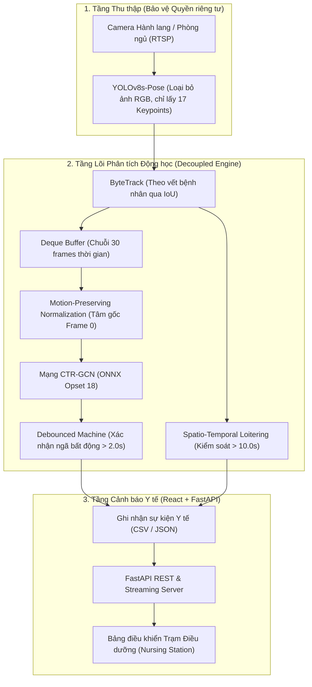

# Hệ thống Giám sát Y tế Thông minh: Phát hiện Té ngã Bảo vệ Quyền riêng tư (Smart Healthcare - Privacy-Preserving Fall Detection)

<p align="center">
  
  
  
  
  
  
  
  
  
</p>

Hệ thống giám sát an toàn chuyên dụng cho **Viện dưỡng lão, Bệnh viện và Chăm sóc người cao tuổi tại nhà (Ambient Assisted Living)**. Giải pháp tập trung giải quyết rào cản lớn nhất của các hệ thống camera giám sát truyền thống: **Sự xâm phạm quyền riêng tư**. 

Bằng cách chỉ trích xuất và phân tích ma trận 17 điểm khớp xương giải phẫu (Skeleton-based) thông qua mạng học sâu đồ thị **CTR-GCN**, hệ thống hoàn toàn mù màu trước khuôn mặt, giới tính, màu da và trang phục của bệnh nhân. Trọng tâm của dự án là nhận diện tức thời cú ngã (falling) và các triệu chứng cảnh báo sớm (lảo đảo/tiền đột quỵ) với độ trễ siêu thấp dưới 30ms.

---

## Mục lục
- [1. Danh mục hành vi Y tế & Chăm sóc (Healthcare Taxonomy)](#1-danh-mục-hành-vi-y-tế--chăm-sóc-healthcare-taxonomy)
- [2. Kiến trúc tổng thể hệ thống (Architecture)](#2-kiến-trúc-tổng-thể-hệ-thống-architecture)
- [3. Giải pháp Bảo vệ quyền riêng tư & Loại bỏ báo giả](#3-giải-pháp-bảo-vệ-quyền-riêng-tư--loại-bỏ-báo-giả)
- [4. Cơ sở khoa học của các Dataset](#4-cơ-sở-khoa-học-của-các-dataset)
- [5. Kết quả thực nghiệm (Experimental Benchmark)](#5-kết-quả-thực-nghiệm-experimental-benchmark)
- [6. Cấu trúc thư mục dự án](#6-cấu-trúc-thư-mục-dự-án)
- [7. Cài đặt môi trường](#7-cài-đặt-môi-trường)
- [8. Khởi chạy hệ thống](#8-khởi-chạy-hệ-thống)
- [9. Huấn luyện mô hình CTR-GCN](#9-huấn-luyện-mô-hình-ctr-gcn)

---

## 1. Danh mục hành vi Y tế & Chăm sóc (Healthcare Taxonomy)

Hệ thống phân loại tình trạng bệnh nhân thành 4 trạng thái chuẩn y tế, kết hợp AI học sâu đồ thị và máy trạng thái logic:

| Tình trạng | Mã nhãn (`label`) | Cơ chế nhận diện | Phân loại báo động | Ý nghĩa Y tế & Chăm sóc |
| :--- | :---: | :---: | :---: | :--- |
| **Sinh hoạt bình thường** | `normal` | CTR-GCN (ONNX) | Bình thường (ADL) | Bệnh nhân tự đi lại, ngồi đọc sách, nằm ngủ trên giường, các hoạt động (Activities of Daily Living) an toàn. |
| **Tiền đột quỵ / Lảo đảo** | `staggering` | CTR-GCN (ONNX) | Cảnh báo sớm | Bệnh nhân mất thăng bằng, ôm đầu, ôm ngực, đứng không vững. Báo động trước khi cú ngã thực sự xảy ra. |
| **Té ngã / Đột quỵ** | `falling` | CTR-GCN + Debounced State Machine | Khẩn cấp | Rơi ngã đột ngột, trục cơ thể nằm ngang và bất động. Tự động gọi y tá/bác sĩ trực. |
| **Đi lang thang vô thức** | `loitering` | Spatio-Temporal Rule Engine | Lưu ý theo dõi | Hiện diện thẫn thờ trong một khu vực vượt ngưỡng thời gian (triệu chứng Alzheimer/Dementia) hoặc bệnh nhân đi lạc khỏi giường bệnh quá lâu. |

---

## 2. Kiến trúc tổng thể hệ thống (Architecture)



---

## 3. Giải pháp Bảo vệ quyền riêng tư & Loại bỏ báo giả

### 3.1. Tại sao lại là Skeleton-based (Khung xương)?
Việc lắp đặt camera RGB tại phòng ngủ của bệnh viện, viện dưỡng lão hay nhà riêng gặp phải sự phản đối dữ dội vì lo ngại xâm phạm đời tư. 
- Hệ thống giải quyết bằng cách **xóa bỏ hoàn toàn hình ảnh pixel**. Đầu vào của mạng nơ-ron không phải là ảnh chụp, mà là một ma trận toán học chứa tọa độ $(x, y)$ của 17 điểm khớp xương. AI hoàn toàn "mù màu" về khuôn mặt, cơ thể và giới tính của người bệnh.

### 3.2. Chống báo giả ngã: Máy trạng thái (Falling Debounce) & Chuẩn hóa (Normalization)
Người cao tuổi thường có các cử động nhặt đồ rơi, thắt dây giày, hoặc từ từ ngả lưng xuống giường. Các hệ thống cũ (chỉ nhận diện khung hình tĩnh) sẽ liên tục báo động giả.
1. **Bảo toàn gia tốc rơi tự do:** Việc neo toàn bộ 30 frames vào gốc tọa độ của Frame đầu tiên (Frame 0) giúp AI mạng đồ thị tính toán được vận tốc rơi tự do theo trục đứng $Y$.
2. **Kiểm duyệt bất động (Immobility Check):** Khi AI đồ thị nhận định người bệnh đã ngã (`FALL_CANDIDATE`), hệ thống bắt buộc người đó phải duy trì trạng thái nằm ngang và biến thiên dao động bằng 0 trong vòng **2.0 giây**. Nếu người đó ngồi dậy hoặc tiếp tục nhặt đồ, cảnh báo lập tức bị hủy bỏ.

---

## 4. Cơ sở khoa học của các Dataset

Để huấn luyện thành công mô hình đạt độ chính xác Y khoa (96.43%), hệ thống tổng hợp bộ dữ liệu từ 3 nguồn uy tín trên thế giới nhằm đảm bảo 3 vai trò:

1. **NTU RGB+D 120 (Vai trò: Huấn luyện bộ khung cơ sở - Backbone Pretraining)**
   - *Lý do:* Là tập dữ liệu hành động lớn nhất thế giới, cung cấp đa dạng động tác của cơ thể người. Hệ thống chọn lọc các nhãn Y tế: `A43 (Ngã)`, `A41 (Ho/Ốm)`, `A42 (Lảo đảo/Mất thăng bằng)`, `A44 (Đau ôm đầu)` để dạy cho CTR-GCN cách học chuyển động chung.
2. **UP-Fall Detection Dataset (Vai trò: Đa góc máy chiếu - Multi-view Robustness)**
   - *Lý do:* Camera phòng bệnh có thể lắp trần, góc chéo hoặc ngang. Tập dữ liệu này cung cấp các cú ngã từ đa góc máy (Multi-camera).
3. **UR Fall Detection Dataset & Le2i (Vai trò: Chống báo giả ADL & Vật cản Occlusion)**
   - *Lý do:* Tập trung cung cấp các chuỗi sinh hoạt dễ nhầm lẫn (ngồi phịch xuống sô-pha, nằm ra giường) và mô phỏng ngã bị khuất sau vật cản (sofa, bàn) - đặc trưng của phòng ngủ diện tích hẹp.

---

## 5. Kết quả thực nghiệm (Experimental Benchmark)

Kết quả đo đạc từ quá trình huấn luyện và kiểm thử trên **1.150 mẫu** chuỗi khung xương hoàn toàn độc lập với tập huấn luyện:

### Bảng 1: Kết quả phân loại chuẩn y tế trên tập kiểm thử (Test Set)

| Tình trạng (Class) | Precision | Recall | F1-Score | Số lượng kiểm thử |
| :--- | :---: | :---: | :---: | :---: |
| **Normal** (Sinh hoạt ADL) | 0.93 | 0.96 | **0.94** | 367 |
| **Staggering** (Lảo đảo) | 0.97 | 0.95 | **0.96** | 469 |
| **Falling** (Té ngã) | **1.00** | **1.00** | **1.00** | 314 |
| **Độ chính xác tổng thể (Accuracy)** | | | **96.43%** | **1.150** |
| **Macro Average** | **0.97** | **0.97** | **0.9669** | **1.150** |

> **Phân tích:** Hành vi **Falling (Té ngã)** đạt tỷ lệ chuẩn xác tuyệt đối 100% nhờ sự kết hợp chặt chẽ giữa tính năng giữ nguyên tọa độ động học Frame 0 và thuật toán học ma trận kề $A+M$ của mạng CTR-GCN.

### Bảng 2: So sánh hiệu suất thời gian thực triển khai (Real-time Deployment)

| Chỉ số hệ thống | Baseline Cũ (LSTM, Đơn luồng) | Mô hình Đề xuất (CTR-GCN ONNX, Đa luồng) |
| :--- | :---: | :---: |
| **Bảo vệ quyền riêng tư** | Có | **Có (100% Skeleton)** |
| **Khung hình camera (FPS)** | 12 - 15 FPS (Bị nghẽn bởi AI) | **30.0 FPS (Độc lập mượt mà)** |
| **Độ trễ AI (AI Latency)** | ~65 - 75 ms | **~24 - 28 ms (Triển khai trên CPU Edge)** |
| **Báo động giả (False Alarms)** | Cao (khi người già cúi gập nhặt đồ) | **Loại bỏ (Nhờ Debounce State Machine 2.0s)** |

---

## 6. Cấu trúc thư mục dự án

```text
Abnormal_Behavior_Detection_System/
├── api/                                    # API Backend cấp phát cho trạm điều dưỡng
├── behavior-detection-web/                 # Màn hình cảnh báo React JS thời gian thực
├── config/                                 # File cấu hình (settings.py - đổi nhãn y tế)
├── core/
│   ├── detection/                          # Trích xuất 17 điểm khớp xương người bệnh
│   ├── models/                             # Kiến trúc Spatio-Temporal CTR-GCN và Baseline
│   └── inference/                          # Hàng đợi đa luồng, máy trạng thái Debounce chống báo giả
├── scripts/                                # Script tải dữ liệu (Fall, ADL) và chạy huấn luyện
├── weights/                                # Trọng số đã tối ưu (yolov8s-pose.pt, ctrgcn_best.onnx)
├── data/                                   # Nơi lưu trữ video y tế thô và chuỗi .npy đã bóc tách
├── notebooks/                              # File Google Colab tự động huấn luyện trên GPU T4
├── run_webcam_demo.py                      # Chạy demo cục bộ (hiển thị thông số FPS/Ms)
└── start_system.bat                        # Script khởi chạy 1 click toàn bộ hệ thống
```

---

## 7. Cài đặt môi trường

1. Đảm bảo có **Python 3.9+** và **Node.js 18+**.
2. Clone và kích hoạt môi trường ảo (Virtual Environment):
   ```bash
   git clone -b dev https://github.com/NBasLongz/realtime-abnormal-behavior-detection.git
   cd realtime-abnormal-behavior-detection
   python -m venv venv
   # Windows: .\venv\Scripts\Activate.ps1
   # Linux/Mac: source venv/bin/activate
   ```
3. Cài đặt thư viện AI và Frontend:
   ```bash
   pip install --upgrade pip
   pip install -r requirements.txt
   cd behavior-detection-web && npm install && cd ..
   ```

---

## 8. Khởi chạy hệ thống

### Cách 1: Khởi động Trạm điều dưỡng hoàn chỉnh (Full Web Dashboard)
- Trên Windows, nhấp đúp file `start_system.bat` hoặc chạy lệnh:
  ```cmd
  start_system.bat
  ```
- Backend sẽ chạy tại `http://localhost:8000` và Frontend cảnh báo tại `http://localhost:5173`.

### Cách 2: Khởi động giao diện cửa sổ kiểm thử tại Edge (Camera Node)
Để kiểm tra độ trễ AI trực tiếp trên máy không cần bật trình duyệt:
```bash
python run_webcam_demo.py
```
*(Bấm ESC trên cửa sổ video để tắt)*

---

## 9. Huấn luyện mô hình CTR-GCN

Sử dụng trực tiếp file [notebooks/Colab_Train_CTRGCN.ipynb](file:///F:/Project/Abnormal_Behavior_Detection_System/notebooks/Colab_Train_CTRGCN.ipynb) trên Google Colab để huấn luyện tự động 7 bước. Code tự động bóc tách các tập video ngã (Fall) và sinh hoạt (ADL), chuẩn hóa ma trận GCN, huấn luyện bằng AdamW + CosineAnnealingLR, và tự động nén mô hình xuất ra định dạng **ONNX Opset 18** (chuyên dụng cho CPU/IoT Edge trong bệnh viện).

---

## Giấy phép (License)
Mã nguồn mở cấp phép theo **MIT License**. Khuyến khích ứng dụng vào các bệnh viện, khu chăm sóc, và sản phẩm công nghệ vì sức khỏe cộng đồng.
