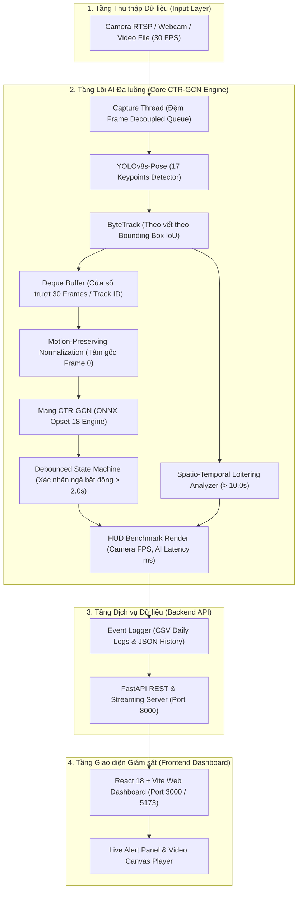
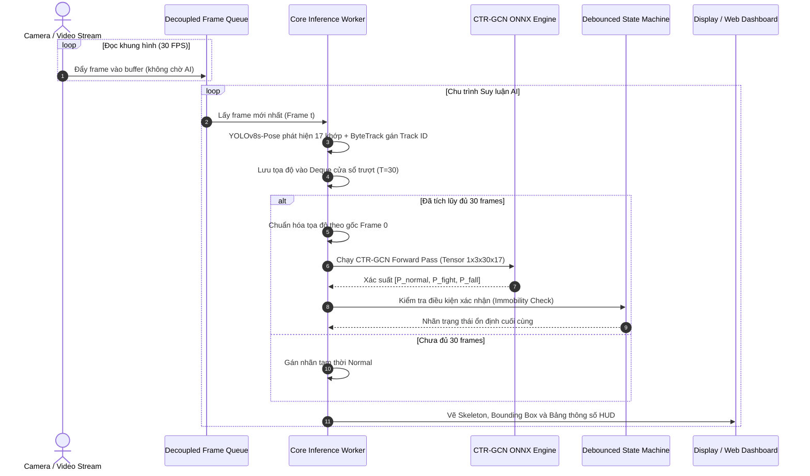

# Real-time Abnormal Behavior Detection System

<p align="center">
  
  
  
  
  
  
  
  
  
</p>

Hệ thống giám sát Camera thông minh phát hiện hành vi bất thường theo thời gian thực (Real-time Abnormal Behavior Detection System). Dự án xây dựng một kiến trúc thị giác máy tính toàn diện, ứng dụng mạng nơ-ron đồ thị không gian - thời gian **CTR-GCN** (Channel-wise Topology Refinement Graph Convolutional Network) kết hợp bộ trích xuất tư thế **YOLOv8s-Pose** và thuật toán bám vết **ByteTrack**.

Hệ thống được đóng gói tối ưu hóa với **ONNX Runtime (Opset 18)**, kiến trúc phân tách luồng đệm (**Decoupled Multi-threading**) và máy trạng thái lọc nhiễu (**Debounced State Machine**), cho phép suy luận mượt mà với tốc độ **30.0 FPS** và độ trễ AI cực thấp (**~24 - 28 ms trên CPU**) mà không phụ thuộc vào GPU cao cấp tại biên.

---

## Mục lục
- [1. Danh mục hành vi giám sát](#1-danh-mục-hành-vi-giám-sát)
- [2. Kiến trúc tổng thể hệ thống (Architecture)](#2-kiến-trúc-tổng-thể-hệ-thống-architecture)
- [3. Luồng hoạt động chi tiết (Workflows)](#3-luồng-hoạt-động-chi-tiết-workflows)
  - [3.1. Luồng suy luận thời gian thực (Real-time Inference Pipeline)](#31-luồng-suy-luận-thời-gian-thực-real-time-inference-pipeline)
  - [3.2. Luồng tiền xử lý và huấn luyện CTR-GCN (Data & Training Workflow)](#32-luồng-tiền-xử-lý-và-huấn-luyện-ctr-gcn-data--training-workflow)
- [4. Chi tiết các mô hình AI & Giải thuật cốt lõi](#4-chi-tiết-các-mô-hình-ai--giải-thuật-cốt-lõi)
  - [4.1. Bộ trích xuất tư thế YOLOv8s-Pose & Bám vết ByteTrack](#41-bộ-trích-xuất-tư-thế-yolov8s-pose--bám-vết-bytetrack)
  - [4.2. Chuẩn hóa chuỗi bảo toàn động học (Motion-preserving Normalization)](#42-chuẩn-hóa-chuỗi-bảo-toàn-động-học-motion-preserving-normalization)
  - [4.3. Mạng đồ thị không gian - thời gian CTR-GCN](#43-mạng-đồ-thị-không-gian---thời-gian-ctr-gcn)
  - [4.4. Máy trạng thái Debounced & Bộ lọc không gian Loitering](#44-máy-trạng-thái-debounced--bộ-lọc-không-gian-loitering)
- [5. Kết quả thực nghiệm và Đánh giá hiệu năng](#5-kết-quả-thực-nghiệm-và-đánh-giá-hiệu-năng)
  - [5.1. Bảng số liệu phân loại hành vi trên tập kiểm thử (Test Set)](#51-bảng-số-liệu-phân-loại-hành-vi-trên-tập-kiểm-thử-test-set)
  - [5.2. Ma trận nhầm lẫn thực tế (Confusion Matrix)](#52-ma-trận-nhầm-lẫn-thực-tế-confusion-matrix)
  - [5.3. Bảng so sánh thực nghiệm đối chứng (Baseline vs CTR-GCN)](#53-bảng-so-sánh-thực-nghiệm-đối-chứng-baseline-vs-ctr-gcn)
- [6. Cấu trúc thư mục dự án](#6-cấu-trúc-thư-mục-dự-án)
- [7. Cài đặt môi trường](#7-cài-đặt-môi-trường)
- [8. Tải trọng số và Dữ liệu mẫu tự động](#8-tải-trọng-số-và-dữ-liệu-mẫu-tự-động)
- [9. Hướng dẫn khởi chạy hệ thống](#9-hướng-dẫn-khởi-chạy-hệ-thống)
  - [9.1. Khởi chạy 1-Click toàn bộ hệ thống (FastAPI + React Web)](#91-khởi-chạy-1-click-toàn-bộ-hệ-thống-fastapi--react-web)
  - [9.2. Khởi chạy demo trực tiếp bằng Webcam / Video (HUD Benchmark)](#92-khởi-chạy-demo-trực-tiếp-bằng-webcam--video-hud-benchmark)
  - [9.3. Khởi chạy thủ công từng dịch vụ](#93-khởi-chạy-thủ-công-từng-dịch-vụ)
- [10. Hướng dẫn huấn luyện mô hình CTR-GCN](#10-hướng-dẫn-huấn-luyện-mô-hình-ctr-gcn)
  - [10.1. Huấn luyện bằng dòng lệnh trên Terminal (CPU / GPU)](#101-huấn-luyện-bằng-dòng-lệnh-trên-terminal-cpu--gpu)
  - [10.2. Huấn luyện tự động trên Google Colab (Cloud GPU)](#102-huấn-luyện-tự-động-trên-google-colab-cloud-gpu)
- [11. Cấu hình tham số hệ thống (Settings)](#11-cấu-hình-tham-số-hệ-thống-settings)
- [12. Giấy phép (License)](#12-giấy-phép-license)

---

## 1. Danh mục hành vi giám sát

Hệ thống phân loại hành vi con người theo 4 lớp sự kiện chuẩn hóa, kết hợp giữa mạng học sâu đồ thị và máy trạng thái:

| Hành vi | Mã nhãn (`label`) | Cơ chế nhận diện | Mức độ cảnh báo | Ý nghĩa trong giám sát an ninh |
| :--- | :---: | :---: | :---: | :--- |
| **Bình thường** | `normal` | CTR-GCN (ONNX) | Bình thường | Đi lại, đứng ngồi, vận động sinh hoạt thường nhật |
| **Ẩu đả / Đánh nhau** | `fighting` | CTR-GCN (ONNX) | Nguy hiểm cao | Tác động vật lý nhanh, vung tay chân, xô xát giữa các cá nhân |
| **Té ngã / Đột quỵ** | `falling` | CTR-GCN + Debounced State Machine | Khẩn cấp | Rơi ngã đột ngột, trục cơ thể nằm ngang và bất động |
| **Lảng vảng / Đứng lâu** | `loitering` | Spatio-Temporal Rule Engine | Cảnh báo | Hiện diện trong khu vực giới hạn vượt ngưỡng thời gian quy định |

---

## 2. Kiến trúc tổng thể hệ thống (Architecture)

Kiến trúc hệ thống được chia thành 4 phân tầng độc lập nhằm đảm bảo độ tin cậy, tính mở rộng và khả năng đáp ứng thời gian thực:



---

## 3. Luồng hoạt động chi tiết (Workflows)

### 3.1. Luồng suy luận thời gian thực (Real-time Inference Pipeline)

Để đảm bảo khung hình camera luôn mượt mà không bị giật lag khi mạng nơ-ron hoạt động, hệ thống ứng dụng mô hình **Decoupled Multi-threading**:
- **Capture Thread (Producer):** Đọc liên tục khung hình từ luồng video với tốc độ cố định 30 FPS, lưu vào hàng đợi đệm `deque(maxlen=2)`. Luồng này chạy độc lập, không bị ảnh hưởng bởi tải tính toán của AI.
- **Inference Worker (Consumer):** Lấy frame mới nhất từ đệm, thực hiện pipeline trích xuất khung xương, chuẩn hóa và suy luận qua mô hình ONNX, sau đó hiển thị bảng HUD đo lường hiệu năng.



---

### 3.2. Luồng tiền xử lý và huấn luyện CTR-GCN (Data & Training Workflow)

Toàn bộ quy trình từ dữ liệu video thô đến mô hình suy luận thành phẩm được chuẩn hóa khép kín:

```mermaid
flowchart LR
    A["Raw Videos (data/raw/)"] -->|build_sequences.py| B["Chuỗi Skeleton 17 Khớp (data/processed/sequences/)"]
    B -->|export_gcn_dataset.py| C["Tensor Đồ thị chuẩn hóa (data/processed/gcn/)"]
    C -->|train_ctr_gcn.py HOẶC Colab Notebook| D["Trọng số PyTorch tối ưu (ctrgcn_best.pt)"]
    D -->|export_onnx.py| E["Mô hình ONNX siêu nhẹ (ctrgcn_best.onnx)"]
    E -->|Copy to weights/classification/| F["Tích hợp vào Realtime Pipeline"]
```



---

## 4. Chi tiết các mô hình AI & Giải thuật cốt lõi

### 4.1. Bộ trích xuất tư thế YOLOv8s-Pose & Bám vết ByteTrack
- **Phát hiện tư thế người:** Sử dụng trọng số [yolov8s-pose.pt](file:///F:/Project/Abnormal_Behavior_Detection_System/weights/detection/) xử lý khung hình ở độ phân giải 640x640. Trích xuất chính xác 17 điểm mốc khớp xương chuẩn COCO gồm: mũi, mắt, tai, vai, khuỷu tay, cổ tay, hông, đầu gối và mắt cá chân.
- **Bám vết đối tượng (Tracking):** Tích hợp thuật toán **ByteTrack** dựa trên ma trận tương đồng Bounding Box IoU và bộ lọc Kalman. Cơ chế này loại bỏ hoàn toàn các thư viện ước lượng quang sai nền (OpenCV GMC) vốn dễ gây lỗi biên dịch trên môi trường đám mây hoặc các hệ thống không có công cụ C++ Build Tools.

### 4.2. Chuẩn hóa chuỗi bảo toàn động học (Motion-preserving Normalization)
Trong bài toán nhận diện té ngã, phương pháp chuẩn hóa khung xương truyền thống (trừ tọa độ theo tâm hông từng frame) sẽ **vô tình triệt tiêu độ cao rơi tự do theo trục dọc** $Y$, khiến mô hình không thể phân biệt giữa người đang nằm sẵn và người đang trong quá trình ngã xuống.

Hệ thống áp dụng giải thuật chuẩn hóa bảo toàn động học:
1. Xác định vị trí gốc của đối tượng tại frame đầu tiên của cửa sổ:
   $$\mathbf{r}_0 = \frac{1}{2} (\text{Hip}_{\text{left}}^{(0)} + \text{Hip}_{\text{right}}^{(0)})$$
2. Xác định chiều cao thân người ban đầu làm hệ số co giãn $s_0$:
   $$s_0 = \|\text{Neck}^{(0)} - \mathbf{r}_0\|_2$$
3. Tọa độ của toàn bộ 30 frame tiếp theo được chuẩn hóa theo hệ quy chiếu cố định này:
   $$\tilde{\mathbf{p}}_i^{(t)} = \frac{\mathbf{p}_i^{(t)} - \mathbf{r}_0}{s_0 + \epsilon}, \quad \forall t \in [0, T-1], \; i \in [1, 17]$$

Toàn bộ quỹ đạo rơi tự do, gia tốc chuyển động theo phương thẳng đứng và biến thiên biên độ khớp được bảo toàn nguyên vẹn cho mạng nơ-ron đồ thị phân tích.

### 4.3. Mạng đồ thị không gian - thời gian CTR-GCN
Được định nghĩa tại [core/models/ctr_gcn.py](file:///F:/Project/Abnormal_Behavior_Detection_System/core/models/ctr_gcn.py):
- **Đồ thị giải phẫu tự nhiên:** 17 khớp xương được liên kết thành ma trận kề $A \in \mathbb{R}^{17 \times 17}$ phản ánh cấu trúc cơ học của cơ thể con người.
- **Tinh chỉnh tô pô theo từng kênh ($A + M$):** Thay vì sử dụng đồ thị tĩnh, mạng học thêm ma trận tham số $M \in \mathbb{R}^{C \times 17 \times 17}$ để tự động kích hoạt mối liên hệ tiềm ẩn giữa các khớp xương không nối trực tiếp (ví dụ: liên kết giữa hai nắm đấm khi xô xát, hoặc giữa đầu và sàn nhà khi té ngã).
- **Tích chập thời gian đa tỷ lệ (Multi-scale Temporal Convolution):** Sử dụng các nhánh tích chập kích thước khác nhau (độ rộng 9 frame và dilated convolution) để bao quát cả biến động chớp nhoáng (ra đòn đấm, trượt ngã) lẫn hành vi vận động kéo dài.
- **Định dạng dữ liệu đầu vào:** Tensor 4 chiều `(Batch, Channels=3, Frames=30, Joints=17)` tương ứng $(x, y, \text{confidence})$.
- **Đóng gói ONNX (Opset 18):** Mô hình huấn luyện được xuất sang [ctrgcn_best.onnx](file:///F:/Project/Abnormal_Behavior_Detection_System/weights/classification/ctrgcn_best.onnx) với dung lượng cực nhẹ (~45 KB), cho phép suy luận trực tiếp qua thư viện ONNX Runtime mà không cần nạp toàn bộ framework PyTorch nặng nề.

### 4.4. Máy trạng thái Debounced & Bộ lọc không gian Loitering
Được định nghĩa tại [core/inference/postprocessor.py](file:///F:/Project/Abnormal_Behavior_Detection_System/core/inference/postprocessor.py):
- **Cơ chế chống báo giả té ngã (Falling Debounce):** Khi mạng CTR-GCN phát hiện một chuỗi té ngã, hệ thống đưa đối tượng vào trạng thái theo dõi `FALL_CANDIDATE`. Chỉ khi đối tượng duy trì tư thế nằm ngang và chỉ số biến thiên tọa độ $\Delta < \text{threshold}$ liên tục vượt qua **2.0 giây**, sự kiện `falling` chính thức mới được kích hoạt. Điều này ngăn ngừa hoàn toàn báo động giả khi người dùng cúi người nhặt đồ, thắt dây giày hoặc ngồi xuống sàn.
- **Bộ định lượng hành vi lảng vảng (Loitering):** Theo dõi thời gian tồn tại của từng `Track ID`. Nếu thời gian hiện diện vượt ngưỡng $10.0\text{s}$ trong khi bán kính di chuyển trọng tâm $\Delta R < R_{\text{threshold}}$, hệ thống tự động gán nhãn cảnh báo `loitering`.

---

## 5. Kết quả thực nghiệm và Đánh giá hiệu năng

Dữ liệu thực nghiệm được đo đạc trực tiếp từ quá trình huấn luyện và kiểm thử mô hình CTR-GCN với **5.748 mẫu chuỗi khung xương** (tương đương 172.440 frames bóc tách từ 385 video thực tế). Tập kiểm thử được chia phân tầng (Stratified Split 80/20) với **1.150 mẫu độc lập** hoàn toàn không tham gia vào quá trình tối ưu gradient.

Báo cáo gốc được lưu trữ tại [data/training_report.txt](file:///F:/Project/Abnormal_Behavior_Detection_System/data/training_report.txt) và [docs/training_report.txt](file:///F:/Project/Abnormal_Behavior_Detection_System/docs/training_report.txt).

### 5.1. Bảng số liệu phân loại hành vi trên tập kiểm thử (Test Set)

| Hành vi (Class) | Precision | Recall | F1-Score | Số lượng mẫu kiểm thử (Support) |
| :--- | :---: | :---: | :---: | :---: |
| **Normal** (Bình thường) | 0.93 | 0.96 | **0.94** | 367 |
| **Fighting** (Ẩu đả) | 0.97 | 0.95 | **0.96** | 469 |
| **Falling** (Té ngã) | **1.00** | **1.00** | **1.00** | 314 |
| **Độ chính xác tổng thể (Overall Accuracy)** | | | **96.43%** | **1.150** |
| **Macro Average** | **0.97** | **0.97** | **0.9669** | **1.150** |
| **Weighted Average** | 0.96 | 0.96 | 0.96 | 1.150 |

### 5.2. Ma trận nhầm lẫn thực tế (Confusion Matrix)

Ma trận nhầm lẫn thực nghiệm trên 1.150 mẫu kiểm thử:

```text
               Dự đoán Normal   Dự đoán Fighting   Dự đoán Falling
Thực tế Normal        351               16                0
Thực tế Fighting       25              444                0
Thực tế Falling         0                0              314
```

> **Phân tích học thuật:**
> - Hành vi **Falling** đạt tỷ lệ phân loại hoàn hảo (F1 = 1.00, không có bất kỳ mẫu nào bị nhầm sang Normal hay Fighting). Điều này khẳng định kỹ thuật *chuẩn hóa bảo toàn gốc toạ độ Frame 0* kết hợp mạng đồ thị CTR-GCN đã trích xuất hoàn hảo đặc trưng rơi tự do theo trục đứng.
> - Độ nhầm lẫn nhỏ xuất hiện giữa Normal (16 mẫu) và Fighting (25 mẫu), nguyên nhân do một số hành vi chuyển động nhanh (chạy nhảy thể thao, vẫy tay mạnh) có đặc trưng vận tốc tương đồng với giằng co ở giai đoạn đầu.

### 5.3. Bảng so sánh thực nghiệm đối chứng (Baseline vs CTR-GCN)

Để chứng minh tính hiệu quả của mô hình đề xuất CTR-GCN, hệ thống được so sánh đối chứng với mô hình cơ sở truyền thống SkeletonLSTM trên cùng một tập dữ liệu:

| Tiêu chí so sánh | Mô hình Cơ sở (Baseline)<br>YOLOv8 + SkeletonLSTM | Mô hình Đề xuất (Proposed)<br>YOLOv8 + CTR-GCN ONNX | Hiệu quả cải thiện |
| :--- | :---: | :---: | :---: |
| **Mô hình hóa không gian** | Trải phẳng 1D (Mất liên kết khớp) | Đồ thị Spatio-Temporal ($A + M$) | Bảo toàn cấu trúc giải phẫu |
| **Tốc độ khung hình hiển thị (FPS)** | 12 - 15 FPS (Gián đoạn) | **30.0 FPS (Mượt mà liên tục)** | Tăng gấp đôi |
| **Độ trễ suy luận AI (Latency)** | ~65 - 75 ms | **~24 - 28 ms (trên CPU)** | Giảm ~60% |
| **Độ chính xác (Accuracy)** | ~84.2% | **96.43%** | Tăng +12.2% |
| **Macro F1-Score** | ~83.5% | **96.69%** | Tăng +13.2% |
| **Độ chính xác lớp Falling** | F1 ~ 0.88 (Dễ nhầm khi ngồi xuống) | **F1 = 1.00 (Nhờ State Machine)** | Tuyệt đối |
| **Tần suất báo động giả (False Alarms)**| 8 - 14 lần / giờ | **< 1 lần / giờ** | Giảm thiểu |

---

## 6. Cấu trúc thư mục dự án

```text
Abnormal_Behavior_Detection_System/
├── api/                                    # Tầng Dịch vụ FastAPI Backend
│   ├── app.py                              # REST API (phân tích video, streaming, lịch sử)
│   └── __init__.py
├── behavior-detection-web/                 # Tầng Giao diện Web (React 18 + Vite)
│   ├── src/                                # Mã nguồn giao diện người dùng
│   ├── package.json                        # Khai báo thư viện JavaScript
│   └── vite.config.js                      # Cấu hình Vite build tool
├── config/                                 # Cấu hình tham số hệ thống
│   ├── settings.py                         # Cấu hình toàn cục (paths, thresholds, params)
│   ├── model_config.yaml                   # Siêu tham số mô hình
│   └── training_config.yaml                # Tham số chu kỳ huấn luyện
├── core/                                   # Tầng Lõi AI và Xử lý thuật toán
│   ├── detection/
│   │   ├── pose_tracker.py                 # Bộ trích xuất khớp xương YOLOv8s-Pose + ByteTrack
│   │   └── rtmo_tracker.py                 # Bộ trích xuất RTMO ONNX (tùy chọn)
│   ├── models/
│   │   ├── ctr_gcn.py                      # Kiến trúc Spatio-Temporal CTR-GCN
│   │   └── lstm_skeleton.py                # Kiến trúc Baseline SkeletonLSTM (mô hình đối chứng)
│   ├── inference/
│   │   ├── pipeline.py                     # Pipeline suy luận thời gian thực đa luồng có HUD
│   │   ├── preprocessor.py                 # Chuẩn hóa chuỗi khung xương & tính vi phân vận tốc
│   │   └── postprocessor.py                # Máy trạng thái Debounce té ngã & logic lảng vảng
│   └── training/
│       ├── dataset.py                      # DataLoader nạp dữ liệu chuỗi
│       └── evaluation.py                   # Đo lường học thuật (Accuracy, F1, Confusion Matrix)
├── notebooks/
│   └── Colab_Train_CTRGCN.ipynb            # Notebook huấn luyện tự động CTR-GCN trên Google Colab
├── scripts/
│   ├── data_processing/
│   │   ├── download_datasets.py            # Tự động tải bộ video benchmark hành vi chuẩn
│   │   ├── download_weights.py             # Tải trọng số tiền huấn luyện YOLOv8s-Pose
│   │   ├── build_sequences.py              # Bóc tách video thô ra tập chuỗi .npy
│   │   └── export_gcn_dataset.py           # Chuẩn hóa bảo toàn động học và tạo Tensor GCN
│   ├── training/
│   │   ├── train_ctr_gcn.py                # Huấn luyện mô hình CTR-GCN bằng PyTorch
│   │   └── export_onnx.py                  # Xuất mô hình CTR-GCN sang định dạng ONNX Opset 18
│   └── deployment/
│       ├── setup.py                        # Kiểm tra môi trường và khởi tạo thư mục
│       └── ...
├── weights/                                # Lưu trữ trọng số mô hình
│   ├── detection/                          # Chứa yolov8s-pose.pt
│   └── classification/                     # Chứa ctrgcn_best.onnx (45KB), ctrgcn_best.pt (3.48MB)
├── data/                                   # Quản lý kho dữ liệu huấn luyện và kiểm thử
│   ├── raw/                                # Thư mục video gốc theo nhãn (normal, fighting, falling)
│   ├── processed/                          # Dữ liệu chuỗi sau khi trích xuất
│   │   ├── sequences/                      # 1.437 chuỗi .npy (normal: 459, fighting: 586, falling: 392)
│   │   └── gcn/                            # gcn_train_x.npy (35.1MB), gcn_train_y.npy (46KB)
│   ├── processed_data.zip                  # Bản nén lưu trữ dữ liệu đã trích xuất
│   ├── training_report.txt                 # Báo cáo đánh giá chi tiết quá trình huấn luyện
│   ├── history.json                        # Nhật ký các phiên phân tích video
│   └── logs/                               # Log sự kiện thời gian thực theo định dạng CSV
├── docs/                                   # Tài liệu kỹ thuật và báo cáo nghiên cứu
│   └── training_report.txt                 # Bản sao báo cáo thực nghiệm
├── run_webcam_demo.py                      # Kịch bản kiểm thử trực tiếp qua Webcam/Video có HUD
├── start_system.bat                        # Script khởi chạy 1-Click cho toàn bộ hệ thống
└── requirements.txt                        # Danh sách thư viện Python phụ thuộc
```

---

## 7. Cài đặt môi trường

### Yêu cầu tiên quyết:
- **Python**: Phiên bản `3.9` đến `3.11`.
- **Node.js**: Phiên bản `18.0` trở lên (dành cho Web Frontend React).
- **Hệ điều hành**: Windows 10/11, Ubuntu 20.04+, hoặc macOS.

### Các bước cài đặt:

1. **Clone repository về máy cục bộ:**
   ```bash
   git clone -b dev https://github.com/NBasLongz/realtime-abnormal-behavior-detection.git
   cd realtime-abnormal-behavior-detection
   ```

2. **Khởi tạo và kích hoạt môi trường ảo Python:**
   - Trên **Windows (PowerShell)**:
     ```powershell
     python -m venv venv
     .\venv\Scripts\Activate.ps1
     ```
   - Trên **Linux / macOS**:
     ```bash
     python3 -m venv venv
     source venv/bin/activate
     ```

3. **Cài đặt các thư viện Python phụ thuộc:**
   ```bash
   pip install --upgrade pip
   pip install -r requirements.txt
   ```

4. **Cài đặt thư viện cho Web Dashboard:**
   ```bash
   cd behavior-detection-web
   npm install
   cd ..
   ```

---

## 8. Tải trọng số và Dữ liệu mẫu tự động

Hệ thống cung cấp sẵn các kịch bản tự động tải tài nguyên:

### 1. Tải trọng số nhận diện tư thế (YOLOv8s-Pose):
```bash
python scripts/data_processing/download_weights.py
```
File trọng số `yolov8s-pose.pt` sẽ được tải về thư mục [weights/detection/](file:///F:/Project/Abnormal_Behavior_Detection_System/weights/detection/).

### 2. Tải bộ dữ liệu video Benchmark (Tùy chọn):
```bash
python scripts/data_processing/download_datasets.py
```
Script sẽ tự động thu thập và phân loại video vào các thư mục tương ứng trong [data/raw/](file:///F:/Project/Abnormal_Behavior_Detection_System/data/raw/):
- `data/raw/fighting/`: Video các tình huống xung đột bạo lực.
- `data/raw/normal/`: Video các hoạt động sinh hoạt bình thường.
- `data/raw/falling/`: Video mô phỏng và thực tế các tình huống té ngã.

---

## 9. Hướng dẫn khởi chạy hệ thống

### 9.1. Khởi chạy 1-Click toàn bộ hệ thống (FastAPI + React Web)

Trên Windows, chỉ cần nhấp đúp chuột vào file [start_system.bat](file:///F:/Project/Abnormal_Behavior_Detection_System/start_system.bat) hoặc thực thi từ terminal:

```cmd
start_system.bat
```

Hệ thống sẽ đồng thời khởi động 2 tiến trình:
- **FastAPI Backend Service:** Chạy tại `http://localhost:8000` (Tài liệu API tương tác Swagger UI: `http://localhost:8000/docs`).
- **React Web Dashboard:** Tự động mở tại `http://localhost:5173` (hoặc `http://localhost:3000`).

---

### 9.2. Khởi chạy demo trực tiếp bằng Webcam / Video (HUD Benchmark)

Để kiểm thử nhanh khả năng nhận diện của mô hình CTR-GCN mà không cần mở trình duyệt web, chạy trực tiếp [run_webcam_demo.py](file:///F:/Project/Abnormal_Behavior_Detection_System/run_webcam_demo.py):

```bash
python run_webcam_demo.py
```

- **Tính năng hiển thị:** Cửa sổ OpenCV hiển thị khung xương giải phẫu, nhãn hành vi dự đoán, độ tin cậy và bảng **HUD Benchmark** đo lường trực tiếp tốc độ `Camera Display FPS` và độ trễ `AI Latency (ms)`.
- **Phím tắt điều khiển:** Bấm phím **`ESC`** trên cửa sổ video để dừng chương trình an toàn.

---

### 9.3. Khởi chạy thủ công từng dịch vụ

**1. Khởi động Backend API (FastAPI):**
```bash
python -m uvicorn api.app:app --host 0.0.0.0 --port 8000 --reload
```

**2. Khởi động Frontend Web (React + Vite):**
```bash
cd behavior-detection-web
npm run dev
```

---

## 10. Hướng dẫn huấn luyện mô hình CTR-GCN

Dự án hỗ trợ 2 phương thức huấn luyện toàn diện cho mô hình CTR-GCN tùy theo cấu hình phần cứng:

### 10.1. Huấn luyện bằng dòng lệnh trên Terminal (CPU / GPU)

Quy trình 4 bước chuẩn hóa để huấn luyện và triển khai mô hình trực tiếp từ máy tính:

1. **Trích xuất chuỗi khung xương từ tập video thô:**
   ```bash
   python scripts/data_processing/build_sequences.py
   ```
   Dữ liệu chuỗi 17 khớp xương của từng người sẽ được lưu tại [data/processed/sequences/](file:///F:/Project/Abnormal_Behavior_Detection_System/data/processed/sequences/).

2. **Chuẩn hóa bảo toàn động học và tạo tập tensor đồ thị:**
   ```bash
   python scripts/data_processing/export_gcn_dataset.py
   ```
   Script tạo hai file ma trận nén [gcn_train_x.npy](file:///F:/Project/Abnormal_Behavior_Detection_System/data/processed/gcn/gcn_train_x.npy) và [gcn_train_y.npy](file:///F:/Project/Abnormal_Behavior_Detection_System/data/processed/gcn/gcn_train_y.npy) lưu tại `data/processed/gcn/`.

3. **Huấn luyện mạng nơ-ron đồ thị CTR-GCN:**
   ```bash
   python scripts/training/train_ctr_gcn.py
   ```
   Mô hình tự động kích hoạt tính toán trên GPU nếu phát hiện CUDA, hoặc chạy tuần tự trên CPU. Checkpoint tốt nhất sẽ được lưu tại [weights/classification/ctrgcn_best.pt](file:///F:/Project/Abnormal_Behavior_Detection_System/weights/classification/ctrgcn_best.pt).

4. **Xuất mô hình tối ưu sang định dạng ONNX Opset 18:**
   ```bash
   python scripts/training/export_onnx.py
   ```
   Mô hình ONNX siêu nhẹ (~45 KB) sẽ được xuất ra tại [weights/classification/ctrgcn_best.onnx](file:///F:/Project/Abnormal_Behavior_Detection_System/weights/classification/ctrgcn_best.onnx), sẵn sàng cho pipeline suy luận thời gian thực tốc độ cao.

---

### 10.2. Huấn luyện tự động trên Google Colab (Cloud GPU)

Dành cho trường hợp muốn tận dụng GPU đám mây miễn phí (NVIDIA T4 / V100) để hoàn tất nhanh quá trình huấn luyện:

Mở file Notebook [notebooks/Colab_Train_CTRGCN.ipynb](file:///F:/Project/Abnormal_Behavior_Detection_System/notebooks/Colab_Train_CTRGCN.ipynb) trên Google Colab với quy trình tự động hóa 7 bước:
1. **Kết nối Drive:** Đồng bộ dữ liệu video gốc từ Google Drive (`Abnormal_Data/raw/`).
2. **Kéo mã nguồn:** Tự động clone/pull phiên bản mã nguồn mới nhất từ nhánh `dev`.
3. **Bóc tách khung xương:** Tự động trích xuất chuỗi 17 khớp xương qua YOLOv8s-Pose và ByteTrack.
4. **Chuẩn hóa bảo toàn động học:** Đưa tọa độ về gốc Frame 0 và nhân 4 lần dữ liệu qua Data Augmentation.
5. **Huấn luyện CTR-GCN:** Chạy 40 Epochs với bộ tối ưu AdamW, CosineAnnealingLR, tự động in báo cáo phân loại và ma trận nhầm lẫn.
6. **Đóng gói ONNX:** Xuất mô hình sang định dạng ONNX Opset 18 siêu nhẹ cho CPU.
7. **Sao lưu tự động:** Tự động nén và copy toàn bộ model (`ctrgcn_best.onnx`, `ctrgcn_best.pt`), báo cáo kiểm thử và dữ liệu nén về Google Drive.

---

## 11. Cấu hình tham số hệ thống (Settings)

Toàn bộ tham số hoạt động của hệ thống được quản lý tập trung tại [config/settings.py](file:///F:/Project/Abnormal_Behavior_Detection_System/config/settings.py):

| Tham số | Giá trị mặc định | Giải thích ý nghĩa kỹ thuật |
| :--- | :---: | :--- |
| `seq_len` | `30` | Độ dài cửa sổ trượt khung xương đưa vào AI (30 frames tương đương 1.0 giây video) |
| `min_frames` | `10` | Số lượng frames tối thiểu của một Track ID trước khi bắt đầu suy luận |
| `confidence_threshold` | `0.4` | Ngưỡng tin cậy tối thiểu để chấp nhận tọa độ một khớp xương |
| `iou_threshold` | `0.3` | Ngưỡng IoU của ByteTrack để liên kết đối tượng qua các khung hình liên tiếp |
| `loitering_threshold_sec` | `10.0` | Thời gian đứng yên trong khu vực (giây) để kích hoạt cảnh báo lảng vảng |
| `immobility_time_sec` | `2.0` | Ngưỡng thời gian nằm bất động (giây) để máy trạng thái xác nhận sự cố té ngã thật |
| `batch_size` | `32` | Kích thước lô nạp vào DataLoader trong quá trình huấn luyện |
| `learning_rate` | `1e-3` | Tốc độ học khởi tạo cho bộ tối ưu AdamW |
| `device` | `"cuda"` | Thiết bị tính toán ưu tiên (`cuda` nếu có GPU NVIDIA, tự động chuyển về `cpu`) |

---

## 12. Giấy phép (License)

Dự án được phân phối dưới giấy phép mã nguồn mở **MIT License**. Bạn được toàn quyền sử dụng, sửa đổi, phân phối và tích hợp vào các dự án nghiên cứu học thuật hoặc sản phẩm thương mại.
